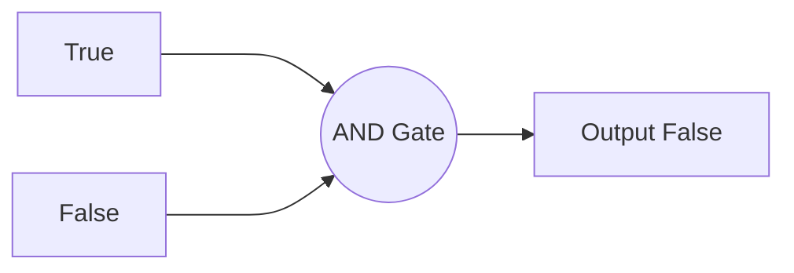
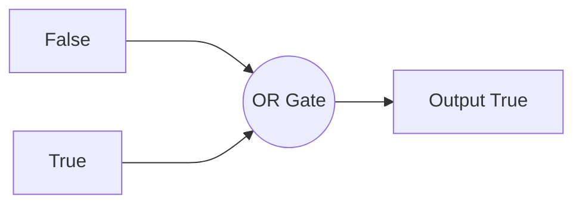
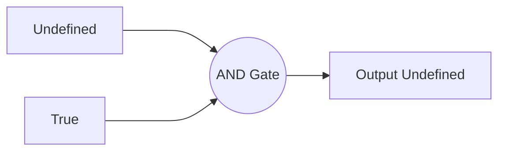

# NanoTekSpice

**NanoTekSpice** is an EPITECH Second Year project.<br>
The goal of this project is to simulate the functioning of an electronic circuit.<br>
In this simulation, each pins can have three distinct value : 0 for False, 1 for True, and U for the Undefined state when we can't compute the value of the pin.

## Configuration File
To give the circuit information to the program we use configuration files like this :
```
.chipsets:
input   a
input   b
4071    or
output  s

.links:
a:1     or:1
b:1     or:2
or:3    s:1
``` 

The *.chipsets*: section is used to create the different components of the circuit.
These components can be either simple, special or complex (cf Components part).

The *.links*: allows you to create links beetwen different components by specifying which have to be linked together. 

## Components
There are 3 types of components: Basic components, Complex components and Special components.

### Basic components :
- AND gate
- OR gate
- XOR gate
- NOT gate
- 4001 (4 * NOR gate)
- 4011 (4 * NAND gate)
- 4030 (4 * XOR gate)
- 4069 (6 * NOT gate)
- 4071 (4 * OR gate)
- 4081 (4 *AND gate)
### Advanced components
- 4008 (4 Bits adder)
- 4013 (Dual Flip Flop)
- 4017 (10 bits Johnson decade)
- 4040 (12 Bits counter)
- 4094 (8 Bits shift register)
- 4512 (8 Channel data selector)
- 4514 (4 bits decoder)
- 4801 (Random access memory)
- 2716 (Read only memory)
### Special components
- Input (The entry point of the circuit)
- Output
- Clock (An input that change of value at each tick of the simulation)
- True
- False
- Logger (Component that write a character following his inputs values)
## Commands
To update and see the simulation results, differents commands are available :
- Exit (Close the program)
- Display (Print the current tick and the value of all inputs and outputs of the circuit is ASCII order)
- Input=value (Set the input to the value)
- Simulate (Simulate a tick of the circuit)
- Loop (Continuously runs the simulation by calling simulate and display until SIGINT is received)

## Examples
Here are a few examples of simple circuit :
- AND Gate :

- OR gate :

- AND gate with Undefined state :

